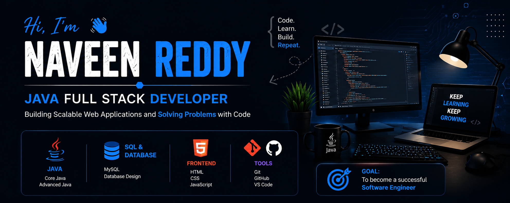

<p align="center">
  
</p>

<div align="center">
  
# 👋 Hi, I'm Naveen Reddy


<br>

### 💻 Java Full Stack Developer | SQL Enthusiast | Problem Solver


</div>

---

# 🚀 About Me

```java
public class NaveenReddy {

    String role = "Java Full Stack Developer";

    String location = "India";

    String[] skills = {

        "Java",

        "SQL",

        "MySQL",

        "HTML",

        "CSS",

        "JavaScript",

        "Git",

        "GitHub"

    };

    String[] learning = {

        "Advanced Java",

        "REST APIs",

        "Data Structures",

        "Algorithms"

    };

    String goal = "Become a Software Engineer";

}
```

---

# 🌟 About Me

- 💻 Passionate Java Full Stack Developer
- 🌱 Currently learning DSA & REST APIs
- 📚 Practicing Data Structures & Algorithms
- 🚀 Interested in Backend Development
- 🤝 Love learning new technologies
- 🎯 Goal: Crack a Software Engineer role

---

# 🌐 Connect With Me

<p align="center">

<a href="https://github.com/VellaNaveenReddy" target="_blank">

</a>

<a href="https://www.linkedin.com/in/vella-naveen-reddy-544a4028b/" target="_blank">

</a>

<a href="mailto:vellanaveenreddy621@gmail.com">

</a>

</p>

---

# 💻 Tech Stack

## 👨‍💻 Languages

<p align="center">


</p>

---

## ⚙ Frameworks & Tools

<p align="center">


</p>

---

# 📚 Currently Learning

✅ REST APIs

✅ Advanced Java

✅ SQL Optimization

✅ Data Structures & Algorithms

---
```markdown
# 📊 GitHub Statistics

<div align="center">


</div>

---

# 🔥 GitHub Streak

<div align="center">


</div>

---

# 📈 GitHub Activity Graph

<div align="center">


</div>

---

# 🏆 GitHub Trophies

<div align="center">


</div>

---

# 💼  Projects

<div align="center">

<a href="https://github.com/VellaNaveenReddy/Portfolio">

</a>

<a href="https://github.com/VellaNaveenReddy/Calculator">

</a>

</div>

<br>

<div align="center">

<a href="https://github.com/VellaNaveenReddy/Employee-Management-System">

</a>

<a href="https://github.com/VellaNaveenReddy/KodNest-Times">

</a>

</div>

---

# 🎯 2026 Goals

- 💻 Build 10+ Java Full Stack Projects
- 📚 Solve 500+ DSA Problems
- ☁ Learn Deployment
- 🚀 Become a Software Engineer
- 🤝 Contribute to Open Source

---

# 📜 Certifications (Coming Soon)

- ☕ Java Programming
- 🗄 SQL & MySQL
- 🌐 Full Stack Development

---
```
````markdown
# 🐍 Contribution Snake

<div align="center">


</div>

---

# 💡 Quote of the Day

<div align="center">

> **"Code. Learn. Build. Repeat."** 🚀

</div>

---

# ☕

```java
public class Success {

    public static void main(String[] args) {

        while (!success) {

            learn();

            practice();

            improve();

            neverGiveUp();
        }
    }
}
```

---

# 🌍 Open To

- 💼 Software Engineer Opportunities
- 🌱 Internship Opportunities
- 🤝 Open Source Contributions
- 🚀 Java Full Stack Projects
- 💡 Learning New Technologies

---

# 📅 2026 Roadmap

✅ Java

✅ SQL & MySQL

✅ HTML & CSS

✅ JavaScript

🔄 Spring Boot

🔄 REST APIs

🔄 React

🎯 Full Stack Developer

---

# 🎯 Fun Facts

- ☕ Coffee + Code = Happiness
- 💻 I enjoy solving programming problems.
- 📚 I believe learning never stops.
- 🚀 Every day is an opportunity to improve.

---

# 📈 Profile Summary

<div align="center">

| 💻 Skill | ⭐ Level |
|----------|----------|
| Java | ⭐⭐⭐⭐⭐ |
| SQL | ⭐⭐⭐⭐☆ |
| HTML | ⭐⭐⭐⭐⭐ |
| CSS | ⭐⭐⭐⭐☆ |
| JavaScript | ⭐⭐⭐⭐☆ |
| Git & GitHub | ⭐⭐⭐⭐☆ |

</div>

---

# ❤️ Support

If you like my work, consider giving a ⭐ to my repositories.

---

<div align="center">

## 🌟 Thanks for Visiting My GitHub Profile!


### 🚀 Let's Build Something Amazing Together!

</div>
````
